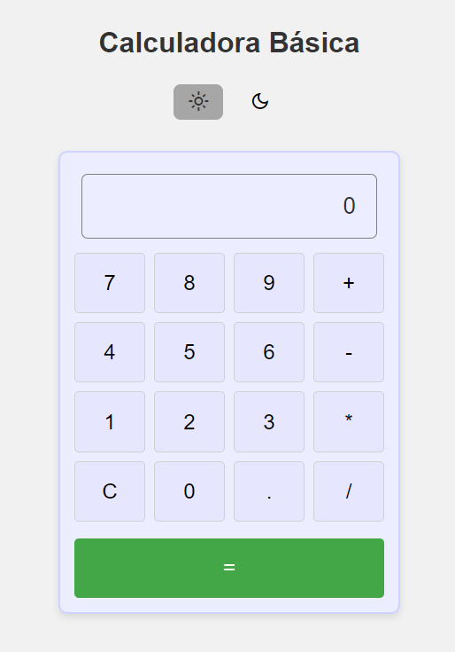
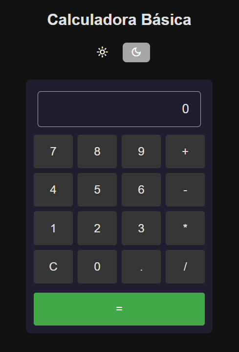

#  🔢 Basics Calculator using HTML, CSS and JS.
This project implements a basic calculator using HTML, CSS, and JavaScript. It supports simple arithmetic operations like addition, subtraction, multiplication, and division. Additionally, it features a modern design with light and dark modes.
 [🌠Visit the Basic Calculator here](https://donluism.github.io/calculadora_basica/)

### 🎯 Features
- Basic arithmetic operations:
  - Addition (+), Subtraction (-), Multiplication (*), Division (/)
- Additional functionality: 
  - Clear screen (AC), Evaluate results (=)
- Modern design:
  - Light and Dark modes for better visual experience.

### 🚀 Technologies Used
- **HTML5**: For the structure of the page.
- **CSS3**: For the visual design and light/dark modes.
- **JavaScript**: For the logic behind the operations and user interaction.
  
---
### 🟰 Results
Here are some screenshots of the calculator in action:

**Light Mode:**  

**Dark Mode:**  

